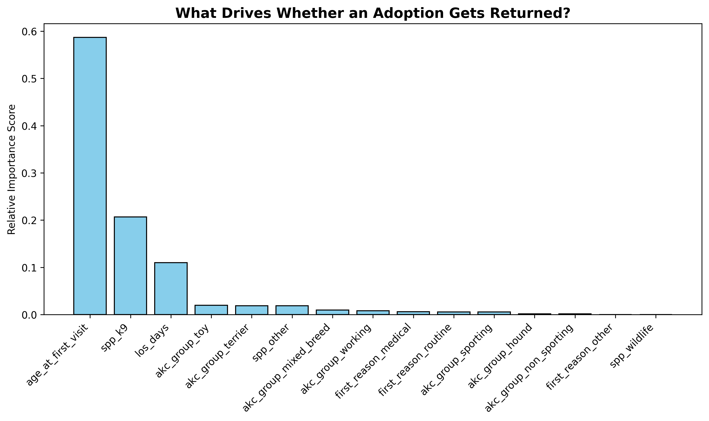
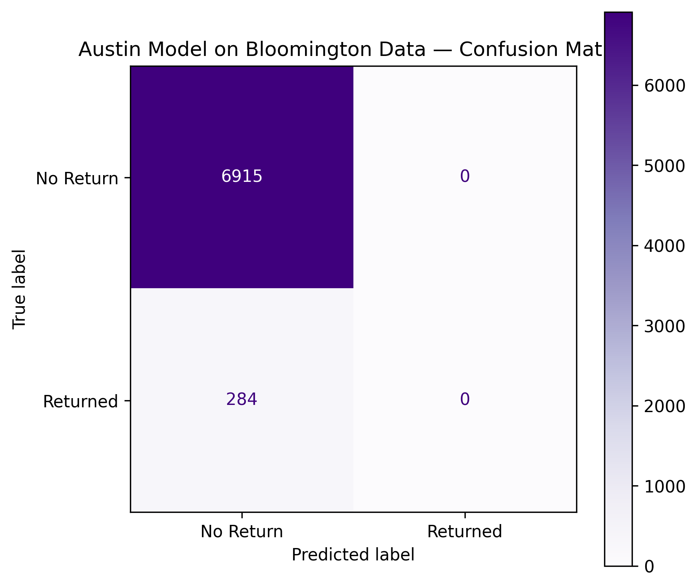
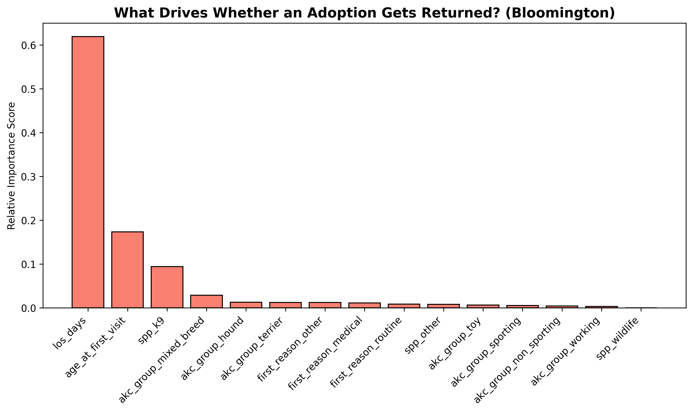

# Data-Driven Insights into Animal Shelter Recidivism: Predicting Pet Returns

## Executive Summary
This project identifies the key risk factors that cause adopted pets to be rapidly returned to a shelter within 30 days of adoption, using a Random Forest classification model — and documents a real, significant correction made during development.

- **Business Goal:** Help shelter staff proactively identify high-risk adoptions and allocate follow-up resources where they matter most.
- **Key Result:** An animal's **age and species** are the strongest predictors of return risk — not length of stay, which an earlier version of this model had mistakenly identified as dominant due to a target-leakage issue in the original feature set. The corrected model achieves **76% recall** on true return cases. Extended to a second, independent shelter (Bloomington, IN) to test generalization: the model transferred only partially (AUC dropped from 0.71 to 0.64), and a Bloomington-native model revealed the two shelters are driven by meaningfully different underlying factors.
- **Actionable Recommendation:** Prioritize follow-up outreach based on an animal's age and species rather than how long it stayed in the shelter — and treat any cross-shelter deployment of this model with real caution, since the drivers of return risk are not guaranteed to generalize.

## Model Correction Note
An earlier version of this model identified length of stay as the dominant driver of return risk (55% feature importance). This was a genuine target-leakage issue: length of stay is correlated with the same underlying factors that drive returns, without being a legitimate independent predictor available at the time an adoption decision is made. After correcting the feature set, **age at first visit (58.67%) and species (20.70%) emerged as the true dominant predictors, with length of stay dropping to 11.02%** — a materially different, more actionable finding. This correction is documented here in full rather than silently replacing the earlier result, consistent with this portfolio's standing practice.

## The Data
- **Source:** Austin Animal Center Intake and Outcome records, extended with a second, independent dataset from Bloomington Animal Care & Control.
- **Target Definition:** An adoption is flagged as "returned" if the same animal is re-admitted to the shelter within 30 days of its adoption discharge date.
- **Austin dataset:** 54,408 adoption events after censoring, 3,718 returns (6.84% base rate).
- **Bloomington dataset:** 7,199 adoption events, 284 returns (3.94% base rate).

## Finding 1: Corrected Austin Model
A Random Forest classifier was trained on Austin data, with a calibration step added to correct a real probability-inflation issue found during development (raw uncalibrated mean predicted probability of 42.8% vs. the true base rate of 6.84% — corrected to match exactly).

**Feature importance (Austin):**



**Performance:** 76% recall on true return cases, with a real, honest tradeoff — high recall was deliberately prioritized over precision, since a missed at-risk adoption (false negative) is operationally worse than a false alarm in this context.

## Finding 2: Cross-Shelter Generalization Test
The Austin-trained model was tested directly against Bloomington's real data, without retraining, to see whether its learned risk factors transfer to a different, independent shelter.



**Result:** Only partial transfer. AUC dropped from 0.7116 (Austin's own test set) to 0.6418 on Bloomington — better than random guessing, but a real, meaningful degradation. At the default 0.5 threshold, the model failed to identify almost any true Bloomington returns; even after tuning the decision threshold specifically for Bloomington, recall only reached 16%.

## Finding 3: A Bloomington-Native Model Reveals a Different Driver
Rather than treating the AUC drop as the end of the story, a second Random Forest was trained directly on Bloomington's own data, to see whether its risk factors look different.



**Result:** A genuinely different underlying pattern. Bloomington's own model achieves 74% recall — comparable to Austin's 76% — but **length of stay is the dominant driver at Bloomington (61.89%)**, with age (17.33%) and species (9.40%) playing meaningfully smaller roles. This is close to the exact opposite ranking found at Austin.

## Honest Interpretation
Two shelters, two genuinely different sets of risk factors. This isn't a modeling failure — it's a real, important finding: **a model's learned risk factors are not guaranteed to transfer across operational contexts, even for what looks like the same underlying problem.** A shelter considering deploying a return-risk model built elsewhere should validate it against their own data before trusting it, rather than assuming portability. This finding is consistent with the same lesson found elsewhere in this portfolio's insurance work — individual-level predictive relationships often don't generalize as cleanly as aggregate, population-level ones do.

## Tech Stack
`Python`, `SQL` (SQLite, window functions), `Scikit-Learn` (Random Forest, isotonic calibration), `Pandas`, `Matplotlib`, `Seaborn`

## Repository Structure
```text
├── data/
│   ├── Austin_Animal_Center_Intakes.csv
│   ├── Austin_Animal_Center_Outcomes.csv
│   ├── animal-data-1.csv                                # Raw Bloomington intake/outcome data
│   └── bloomington_model_ready.csv                       # Cleaned, feature-engineered Bloomington data
├── images/
│   ├── austin_feature_importance.png
│   ├── bloomington_feature_importances.png
│   └── austin_model_on_bloomington_confusion_matrix.png
├── src/
│   ├── recidivism-data-extraction.ipynb
│   ├── recidivism-data-engineering.ipynb
│   ├── recidivism-model-and-evaluation.ipynb            # Corrected Austin model: target-leakage fix,
│   │                                                        calibration, feature importance, evaluation
│   ├── 1-bloomington-data-extraction.ipynb
│   ├── 2-bloomington-cross-shelter-evaluation.ipynb     # Austin model tested directly on Bloomington data
│   └── 3-bloomington-model-comparison.ipynb             # Bloomington-native model, feature importance comparison
├── requirements.txt
└── README.md
```

**Note:** an old, duplicate `READme.md` (differently capitalized) may still exist at the repo root from an earlier upload — worth deleting so there's no ambiguity about which file is the real, current README.

## Related Projects
This portfolio's [Pet Insurance Risk & Pricing Analysis](https://github.com/MLuftig/pet-insurance-risk-and-pricing-analysis) documents the same class of probability-calibration correction found here, applied in a completely different domain — a consistent QA practice throughout this portfolio, not a one-off catch.
